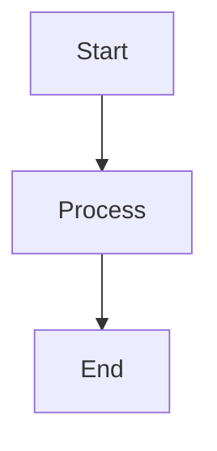
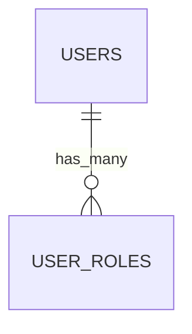

# 図面ドキュメント集（docs/diagrams）

本ディレクトリは、**共通業務基盤システム（マルチテナント SaaS）** の  
ER 図・業務フロー図・画面遷移図・シーケンス図など、  
すべての「図による設計情報」を集約する場所です。

AI（Codax / ChatGPT など）にプロジェクトの仕様を理解させるための
**マスタードキュメント群**としても利用します。

---

# 🎯 目的

- システム全体の構造を図として視覚化し、理解を容易にする  
- ドメイン単位の ER 図で、将来の拡張・追加を容易にする  
- 業務フローや画面遷移の共通化により、UI/UX設計を整える  
- AI に設計仕様を学習させ、コード生成の品質を一定に保つ  

---

# 📁 ディレクトリ構成

図面は **大分類ごとにディレクトリを分けて管理**します。
```
docs/
diagrams/
00_overview/            # システム全体の見取り図・コンテキスト
10_core_platform/       # テナント・認証・権限など基盤領域
20_common_business/     # 顧客・見積・請求など共通業務
30_verticals/           # 建設・教育など業種別拡張
40_ui_navigation/       # 画面遷移・サイトマップ
50_sequences/           # シーケンス図（API、請求処理など）
README.md               # このファイル
```

---

# 📚 ディレクトリ詳細

## 00_overview（システム全体・コンテキスト）

- `system_context.md`  
  外部サービス（メール、認証、決済、ストレージなど）との関係図

- `domain_map.md`  
  「テナント・顧客・見積・請求」がどう繋がるかの全体像

---

## 10_core_platform（基盤）

- `tenant_auth_er.md`  
  テナント／ユーザー／ロール／権限の ER 図

- `tenant_lifecycle_flow.md`  
  テナント作成〜解約までの業務フロー

- `user_auth_flow.md`  
  ログイン／ログアウト／パスワード管理のフロー

---

## 20_common_business（共通業務）

- `customers_tags_memos_er.md`  
  顧客・タグ・メモの ER 図

- `sales_billing_er.md`  
  見積・受注・請求・商品・入金などの ER 図

- `activities_notifications_er.md`  
  日報・帳票・通知・添付ファイルなどの ER 図

- `quote_to_cash_flow.md`  
  見積 → 受注 → 請求 → 入金 の一連業務フロー

---

## 30_verticals（業種別テンプレート）

業界ごとにディレクトリを作成し、ワークフローと ER をまとめます。

例：
```
30_verticals/
construction/
construction_workflow.md
construction_core_er.md
construction_screen_flow.md
```

---

## 40_ui_navigation（画面遷移）

- `admin_sitemap.md`  
  管理画面（/admin）のサイトマップ・画面遷移

- `tenant_app_sitemap.md`  
  テナントユーザー向けアプリの画面遷移

- `mobile_app_sitemap.md`  
  将来のタブレット・スマホ版 UI がある場合

---

## 50_sequences（シーケンス図）

- `api_auth_sequence.md`  
  APIトークン発行/更新/失効の流れ

- `invoice_issue_sequence.md`  
  請求書発行〜送信〜ステータス更新処理

---

# 📝 図面ファイルの命名規約

AI が理解しやすく、人間も迷わない命名に統一します。

### 共通ルール

- 拡張子は **`.md`**（Mermaid 記法を含むため）
- 用途に応じて suffix を統一
  - `*_er.md` … ER 図
  - `*_flow.md` … 業務フロー
  - `*_sitemap.md` … UI ナビゲーション
  - `*_sequence.md` … シーケンス図

### Mermaid 図の例





🤖 AI（Codax / ChatGPT）との利用ルール

AI でコードを生成するときは、対象の図を 必ず参照させること。

例：

「顧客・タグ・メモのモデルを生成してください。
必ず docs/diagrams/20_common_business/customers_tags_memos_er.md の ER 図に従ってください。」

これにより モデル・マイグレーション・コントローラ・画面 が一貫した設計となる。